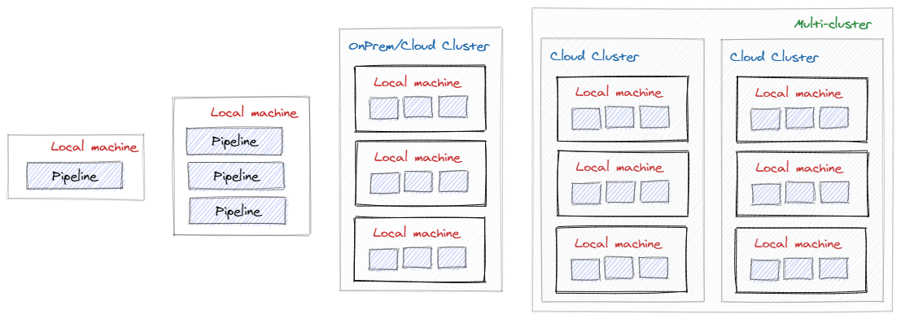

# Pipeline manager
This is a research project aimed at writing a Cloud-native pipeline orchestration platform with the following capabilities:
1) the ability to run on very weak hardware such as [Raspberry Pi](https://en.wikipedia.org/wiki/Raspberry_Pi).
2) modularity - in the simplest scenarios, you may choose not to deploy [Platform](https://github.com/RyazanovAlexander/pipeline-manager.platform) and [Infrastructure](https://github.com/RyazanovAlexander/pipeline-manager.infrastructure) components.
3) [at-least-once](https://medium.com/@andy.bryant/processing-guarantees-in-kafka-12dd2e30be0e#:~:text=At%20least%20once%20guarantee%20means,1.) guarantee of task processing when using the [Platform](https://github.com/RyazanovAlexander/pipeline-manager.platform).
4) the system must be able to handle 1,000,000 requests per second with a large number of established TCP connections and low latency (<50 ms) while consuming relatively few resources.
5) extensibility through the use of Unix/Windows utilities and the ability to deploy custom [Applications](https://github.com/RyazanovAlexander/pipeline-manager.applications) in a cluster.

## Motivation
It's no secret that for a large number of tasks there are already ready-made solutions in the form of a set of utilities. All you need to do is [combine these utilities into the pipeline](https://tldp.org/LDP/GNU-Linux-Tools-Summary/html/c1089.htm).



## Supported scenarios
**Running pipelines in real time on very weak hardware**

The client needs to run pipelines in a minimally resource-intensive environment, such as [Raspberry Pi](https://en.wikipedia.org/wiki/Raspberry_Pi). Latency is at the forefront.


In the [MicroK8s](https://microk8s.io/) installs the [TextProcessing](https://github.com/RyazanovAlexander/pipeline-manager.applications/blob/main/catalog/TextProcessing) application with the number of replicas N.
```yaml
replicaCount:
  min: 10
  max: 10

autoScaling:
  enabled: false
 
resourceQuota:
  enabled: false

ingress:
  enabled: true
```
The [Platform](https://github.com/RyazanovAlexander/pipeline-manager.platform) and [Infrastructure](https://github.com/RyazanovAlexander/pipeline-manager.infrastructure) components are not installed.

In this scenario, the client directly sends tasks to workers with pipelines using the http(s) or gRPC protocols. This configuration allows you to reduce latency to a minimum using the least amount of overhead for processing tasks. Disadvantages of this deployment:
- scaling of workers occurs in manual mode.
- balancing the distribution of tasks on the client side.
- the state of tasks is not stored anywhere or is recorded on the client side.

## Project structure
The project consists of several repositories:
- pipeline-manager - contains documentation, CI/CD and links to other repositories.
- [pipeline-manager.infrastructure](https://github.com/RyazanovAlexander/pipeline-manager.infrastructure) - contains the IaaC used by the platform.
- [pipeline-manager.platform](https://github.com/RyazanovAlexander/pipeline-manager.platform) - contains the main platform services: ApiGateway, Pipeline manager cluster based on [Virtual Actor Model](https://dotnet.github.io/orleans/) and client to cluster for workers.
- [pipeline-manager.platform.app-deployer](https://github.com/RyazanovAlexander/pipeline-manager.platform.app-deployer) - a tool for deploying applications that extend the functionality of the platform.
- [pipeline-manager.worker.command-executor](https://github.com/RyazanovAlexander/pipeline-manager.worker.command-executor) - the gRPC agent used by Pipeline workers to execute processes in pod containers.
- [pipeline-manager.applications](https://github.com/RyazanovAlexander/pipeline-manager.applications) - directory with applications installed using [AppDeployer](https://github.com/RyazanovAlexander/pipeline-manager.platform.app-deployer).


## Local development dependencies
Tools:
- [Helm](https://helm.sh) v3.5.3+
- [Skaffold](https://skaffold.dev) v1.21.0+
- [Minikube](https://minikube.sigs.k8s.io) v1.18.1+
- [Docker](https://www.docker.com) v20.10.5+
- [kubectl](https://kubernetes.io/docs/tasks/tools) v1.20.5+
- [Make](https://www.gnu.org/software/make/manual/make.html) v4.3+

Programming languages:
- [Golang](https://golang.org/) v1.16.2+
- [C#](https://dotnet.microsoft.com/download/dotnet/5.0) v9.0+, .NET 5.0+

IDE:
- [Visual Studio Code](https://code.visualstudio.com)
- [Visual Studio Community 2019](https://visualstudio.microsoft.com/ru/vs/community/)

## Install


## Uninstall
