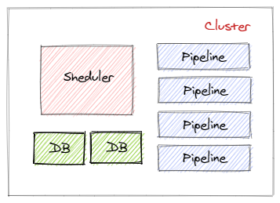
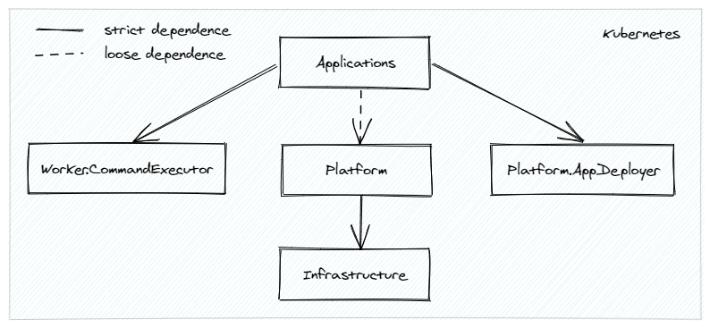

# Pipeline manager
This is a research project aimed at writing a [Cloud-native](https://docs.microsoft.com/en-us/dotnet/architecture/cloud-native/definition) pipeline orchestration platform with the following capabilities:
- the ability to run pipelines on very weak hardware such as [Raspberry Pi](https://en.wikipedia.org/wiki/Raspberry_Pi).
- [at-least-once](https://medium.com/@andy.bryant/processing-guarantees-in-kafka-12dd2e30be0e#:~:text=At%20least%20once%20guarantee%20means,1.) guarantee of task processing when using the [Platform](https://github.com/RyazanovAlexander/pipeline-manager.platform) scheduler.
- horizontal scaling each platform component to handle a large number of requests per second (target 1,000,000) with a large number of established TCP connections and low latency (<50ms) while consuming relatively few cluster resources (condition will be met at the 99th percentile).
- extensibility through the use of Unix/Windows utilities and the ability to deploy custom [Applications](https://github.com/RyazanovAlexander/pipeline-manager.applications) in a cluster.



The main building block in the system is the pipeline. It is a POD with several containers. One of these containers is an agent that interacts with the task scheduler using the tcp protocol. Additionally, the agent acts as a web server, for cases when the user directly runs commands in the pipeline via gRPC or http without using the task scheduler. The rest of the containers contain the utilities involved in the task execution. The result of the work is transmitted through the shared volume.


An example of a task sent to the pipeline:
```yaml
{
  "pipeline": [
    {
      "executorName": "wget",
      "commands": [
        "wget -O /mnt/pipe/2rb88.png https://i.stack.imgur.com/2rb88.png",
        "wget -O /mnt/pipe/text-photographed-eng.jpg https://www.imgonline.com.ua/examples/text-photographed-eng.jpg",
        "wget -O /mnt/pipe/Cleartype-vs-Standard-Antialiasing.gif https://upload.wikimedia.org/wikipedia/commons/b/b8/Cleartype-vs-Standard-Antialiasing.gif"
      ]
    },
    {
      "executorName": "tesseract",
      "commands": [
        "for file in $(ls -v *.*) ; do tesseract $file {file%.*}.txt; done"
      ]
    },
    {
      "executorName": "mc",
      "commands": [
        "mc mb buckets/5840e11b-2117-4036-a6e6-bcff03fbd3c9",
        "mc cp --recursive /mnt/pipe/ buckets/5840e11b-2117-4036-a6e6-bcff03fbd3c9",
        "rm -r /mnt/pipe/*"
      ]
    }
  ]
}
```

The system [architecture](docs/Architecture.md) sections describe the other components of the system.

## Motivation
It's no secret that for a large number of tasks there are already ready-made solutions in the form of a set of utilities. All you need to do is [combine these utilities into the pipeline](https://tldp.org/LDP/GNU-Linux-Tools-Summary/html/c1089.htm).

In the simplest case, it is enough to run such a pipeline on the local computer. When the load increases, additional processes with pipelines are launched until all computer resources are exhausted.

With further growth of loads, it is necessary to add new components to the system, such as a database, queues, a task scheduler and an autoscaling mechanism.


There are a large number of frameworks and services that make it easier to solve this task. For example, [UiPath](https://www.uipath.com) and [Transloadit](https://transloadit.com) allow you to automate routine operations in just a matter of hours, such as processing video, text, etc. But when using such systems, after a while you come across either insufficient performance or with the possibility of customizing scenarios.

This project is designed to solve only one task - **the execution of the pipeline, all tasks of which must be completed in one single pod entirely**. Despite the obvious limitation, compared to workflow engines, this approach allows:
- perfectly scale pods with pipelines.
- dramatically reduce the load on the network due to the absence of the need to send intermediate results to the blob storage.
- excellent customization of pipelines.

In developing this solution, various principles were borrowed from [Temporal](https://temporal.io), [Apache Airflow](http://airflow.apache.org), [Orleans](https://dotnet.github.io/orleans), [Apache Spark](https://spark.apache.org/) and [Dapr](https://github.com/dapr/workflows).

## Supported scenarios
**Running pipelines in real time on very weak hardware**

The client needs to run pipelines in a minimally resource-intensive environment, such as [Raspberry Pi](https://en.wikipedia.org/wiki/Raspberry_Pi). Latency is at the forefront.


In the [MicroK8s](https://microk8s.io/) installs the [TextProcessing](https://github.com/RyazanovAlexander/pipeline-manager.applications/blob/main/catalog/TextProcessing) application with the number of replicas N.
```yaml
replicaCount:
  min: 10
  max: 10

autoScaling:
  enabled: false
 
resourceQuota:
  enabled: false

ingress:
  enabled: true
```
The [Platform](https://github.com/RyazanovAlexander/pipeline-manager.platform) and [Infrastructure](https://github.com/RyazanovAlexander/pipeline-manager.infrastructure) components are not installed.

In this scenario, the client directly sends tasks to workers with pipelines using the http(s) or gRPC protocols. This configuration allows you to reduce latency to a minimum using the least amount of overhead for processing tasks. Disadvantages of this deployment:
- scaling of workers occurs in manual mode.
- balancing the distribution of tasks on the client side.
- the state of tasks is not stored anywhere or is recorded on the client side.

## Project structure
The project consists of several repositories:
- pipeline-manager - contains documentation, CI/CD and links to other repositories.
- [pipeline-manager.infrastructure](https://github.com/RyazanovAlexander/pipeline-manager.infrastructure) - contains the IaaC used by the platform.
- [pipeline-manager.platform](https://github.com/RyazanovAlexander/pipeline-manager.platform) - contains the main platform services: ApiGateway, Pipeline manager cluster based on [Virtual Actor Model](https://dotnet.github.io/orleans/) and client to cluster for workers.
- [pipeline-manager.platform.app-deployer](https://github.com/RyazanovAlexander/pipeline-manager.platform.app-deployer) - a tool for deploying applications that extend the functionality of the platform.
- [pipeline-manager.worker.command-executor](https://github.com/RyazanovAlexander/pipeline-manager.worker.command-executor) - the gRPC agent used by Pipeline workers to execute processes in pod containers.
- [pipeline-manager.applications](https://github.com/RyazanovAlexander/pipeline-manager.applications) - directory with applications installed using [AppDeployer](https://github.com/RyazanovAlexander/pipeline-manager.platform.app-deployer).



## Local development dependencies
Tools:
- [Helm](https://helm.sh) v3.5.3+
- [Skaffold](https://skaffold.dev) v1.21.0+
- [Minikube](https://minikube.sigs.k8s.io) v1.18.1+
- [Docker](https://www.docker.com) v20.10.5+
- [kubectl](https://kubernetes.io/docs/tasks/tools) v1.20.5+
- [Make](https://www.gnu.org/software/make/manual/make.html) v4.3+

Programming languages:
- [Golang](https://golang.org/) v1.16.2+
- [C#](https://dotnet.microsoft.com/download/dotnet/5.0) v9.0+, .NET 5.0+

IDE:
- [Visual Studio Code](https://code.visualstudio.com)
- [Visual Studio Community 2019](https://visualstudio.microsoft.com/ru/vs/community/)

## Install


## Uninstall
